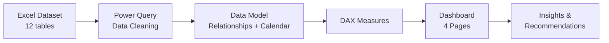
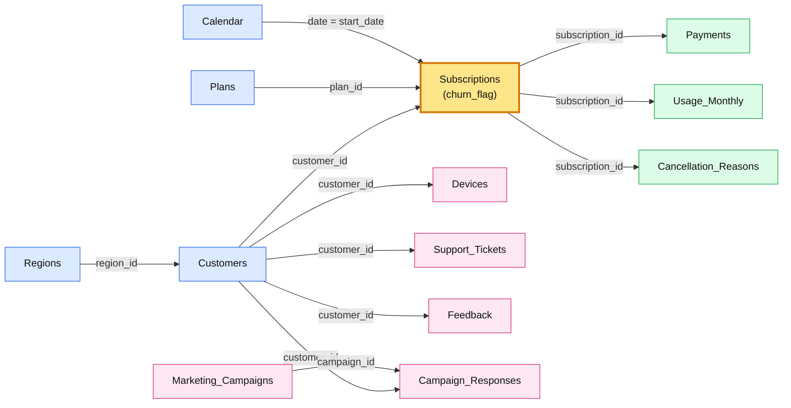
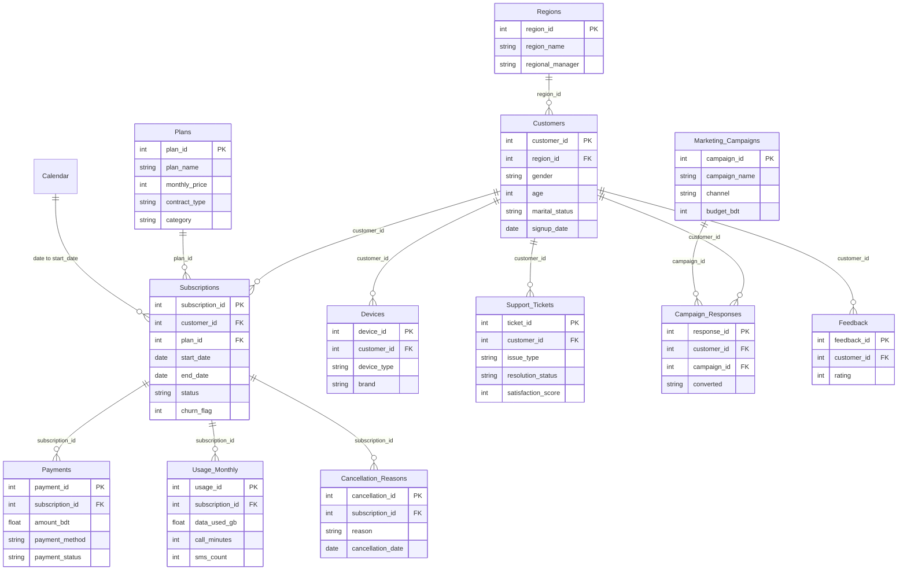
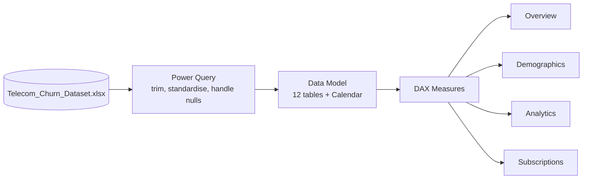
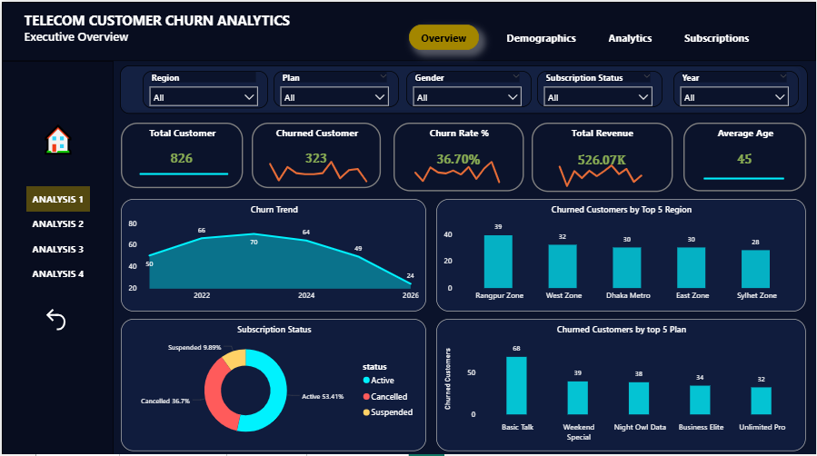
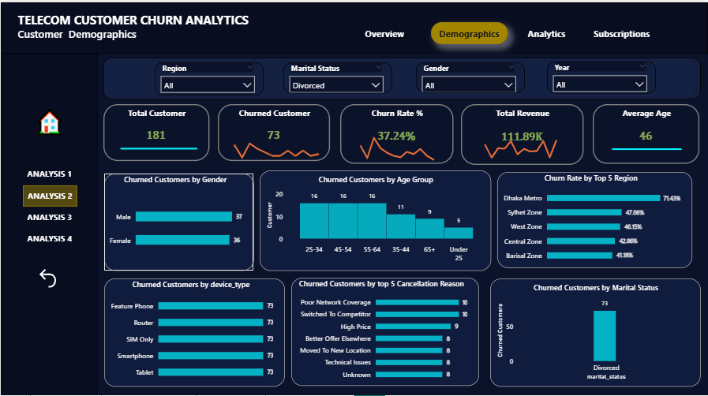
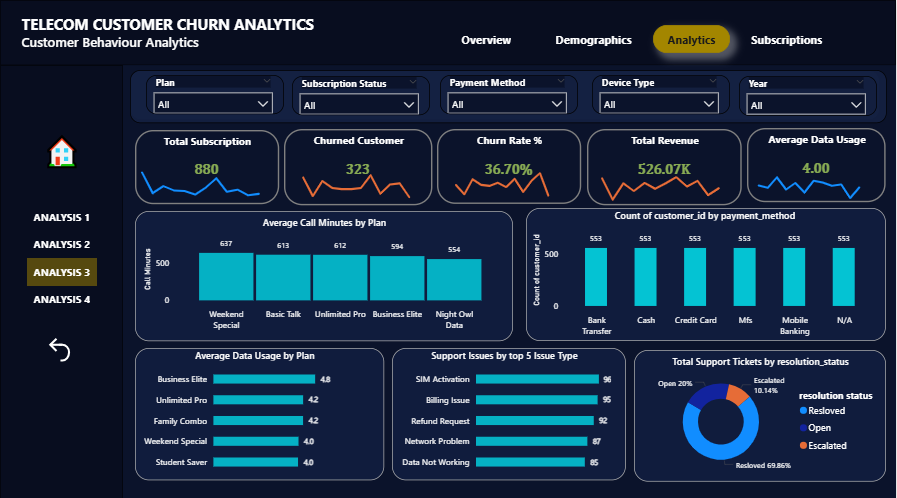
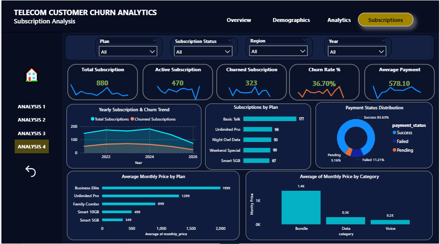

# Telecom Customer Churn Analysis — Power BI Dashboard

Power BI project that shows **who is churning, why, and where to focus retention** for a telecom company (826 customers, 880 subscriptions, 12 related tables).


---

## 1. Project Workflow



---

## 2. Data Model & Relationships

`Subscriptions` is the central fact table. Every other table connects to it either directly or through `Customers`.

### 2.1 Relationship Flow



🟦 Dimension tables · 🟨 Central fact table · 🟩 Subscription details · 🟪 Customer activity

*All relationships are one-to-many (1 → \*), single direction, from the "one" side to the "many" side.*

### 2.2 Entity Relationship Diagram



### 2.3 Data Flow



---

## 3. Folder Structure

```
Telecom Churn Data Analysis/
│
├── Dataset/
│   └── Telecom_Churn_Dataset.xlsx     # Raw data — 12 sheets (tables)
│
├── Power Bi/
│   └── Telecom Churn.pbix             # Power BI report (model + DAX + 4 pages)
│
├── images/
│   ├── overview.png                   # Page 1 screenshot
│   ├── demographics.png               # Page 2 screenshot
│   ├── analytics.png                  # Page 3 screenshot
│   ├── subscriptions.png              # Page 4 screenshot
│   └── demo.gif                       # Dashboard walkthrough
│
└── README.md                          # Project documentation
```

| Folder | Purpose |
|---|---|
| `Dataset/` | Source data used by the report |
| `Power Bi/` | The Power BI file — open this to explore the dashboard |
| `images/` | Screenshots and demo used in this README |

---

## 4. Dataset

| Table | Rows | Table | Rows |
|---|---|---|---|
| Customers | 826 | Support_Tickets | 720 |
| Subscriptions | 880 | Marketing_Campaigns | 15 |
| Plans | 10 | Campaign_Responses | 750 |
| Regions | 12 | Feedback | 710 |
| Payments | 910 | Cancellation_Reasons | 323 |
| Usage_Monthly | 900 | Devices | 760 |

**Data cleaning (Power Query):** raw text columns had many spelling / casing variants, fixed for `status`, `gender`, `country`, `payment_status`, `payment_method`, `resolution_status` and `converted` (e.g. `Actve → Active`, `M → Male`, `Bngladesh → Bangladesh`, `Y / TRUE → Yes`). Missing cancellation reasons were set to `Unknown`.

---

## 5. Key DAX Measures

| Area | Measure | Formula |
|---|---|---|
| Subscriptions | Churn Rate % | `DIVIDE([Churned Subscriptions], [Total Subscriptions], 0)` |
| Subscriptions | Churned Subscriptions | `CALCULATE([Total Subscriptions], Subscriptions[churn_flag] = 1)` |
| Customers | Churned Customers | `CALCULATE(DISTINCTCOUNT(Subscriptions[customer_id]), Subscriptions[churn_flag] = 1)` |
| Revenue | Total Revenue | `SUM(Payments[amount_bdt])` |
| Revenue | Average Payment | `AVERAGE(Payments[amount_bdt])` |
| Usage | Average Data Usage | `AVERAGE(Usage_Monthly[data_used_gb])` |
| Support | Average Satisfaction Score | `AVERAGE(Support_Tickets[satisfaction_score])` |
| Marketing | Conversion Rate % | `DIVIDE([Converted Responses], [Total Responses], 0)` |

---

## 6. Dashboard Pages

### Overview
KPIs, churn trend, subscription status and top churned regions / plans.


### Demographics
Churn by gender, age group, region, device, marital status and cancellation reason.


### Analytics
Call minutes, data usage, payment method, support issues and ticket resolution.


### Subscriptions
Subscription vs churn trend, plans, payment status and pricing.


---

## 7. Key Insights

- **Churn rate is 36.7%** — 323 of 880 subscriptions cancelled (282 of 826 customers).
- **No single cause:** High Price (47), Moved Location (37), Poor Network (36), Bad Customer Service (36), Technical Issues (34).
- **Highest churn rate by plan:** Weekend Special (43%), Business Elite (42%), Night Owl Data (41%).
- **Highest churn rate by region:** Rangpur (43%), West Zone (42%), Khulna (41%).
- **Satisfaction is low** (2.9 / 5) but does not predict churn in this data.
- **Marketing converts ~26%** of responses (197 of 750); Email and SMS perform best.

## 8. Recommendations

- Offer retention discounts to price-sensitive customers.
- Check network and technical complaints in Rangpur, West Zone and Khulna.
- Review the three plans with above-average churn.

## 9. Tools Used

Excel · Power Query · Power BI Desktop · DAX

## 10. How to Use

1. Open `Power Bi/Telecom Churn.pbix` in Power BI Desktop.
2. Use the slicers on each page to filter by region, plan, gender, status or year.
3. Switch pages with the top navigation buttons.